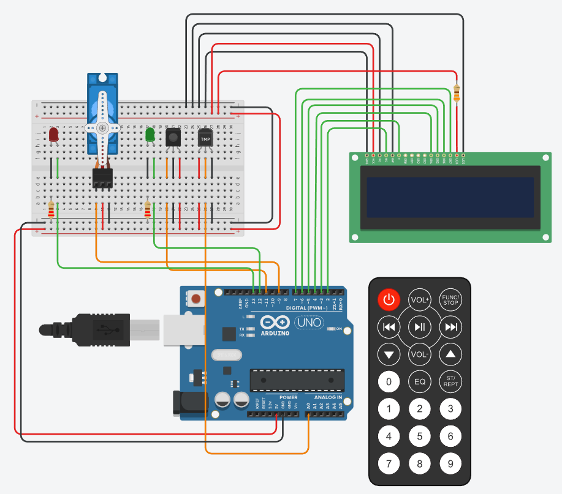
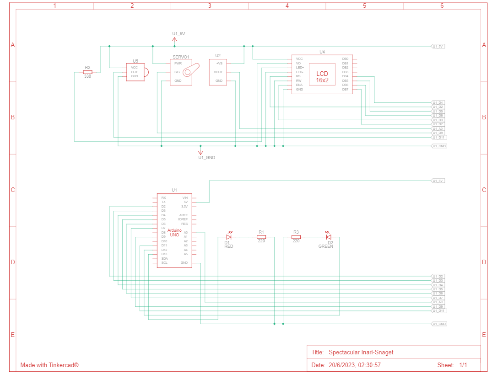
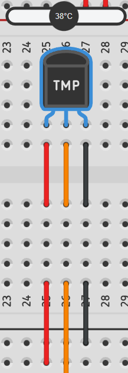
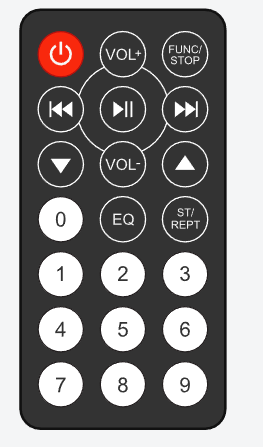
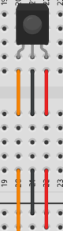
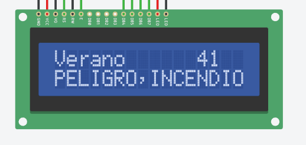
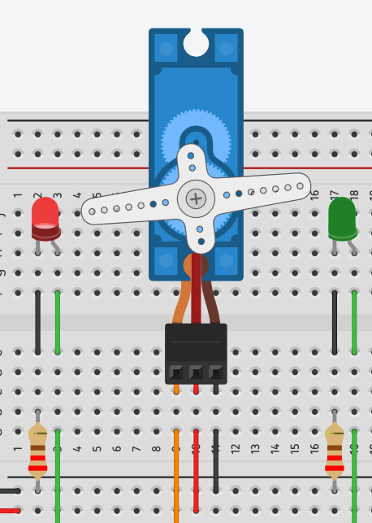
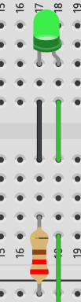
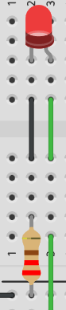

# PARCIAL 2: Sistema de Procesamiento de Datos

## Alumno y division
* Franco Yapura 
* 1J


## Proyecto: Alarma de incendio



## Esquema de la alarma




## Descripcion 

El proyecto consiste en conectar un Arduino a un sensor de temperatura, un sensor IR que responde a un control remoto IR, un display LCD (16x2), dos leds y un servomotor simulando una alarma contra incendios. 

## Componentes

### Sensor de temperatura




El sensor de temperatura transforma un valor de tensión entre 0v y 5v en un número entre 0 y 1023
midiendo una temperatura que regula el usuario.
Se deben conectar tres cables a este, uno será para el Ground, el otro para el 5V y el último será el pin del arduino.

En el código el sensor de temperatura será modificado por el usuario para determinar si la alarma se activa o no.

### Control remoto IR  y sensor IR





Estos dos componentes van juntos ya que el sensor recibe el boton presionado por el control para luego realizar algo en el codigo a partir de esa informacion recibida. Los datos del control remoto se manejan en valores Hexagesimales, por lo que es importante tener a mano todos los valores de cada boton para el codigo. Para trabajar con estos componentes se necesita incorporar una libreria llamada "IRremote".
Tambien deben conectarse tres cables, uno será para el Ground, el otro para el 5V y el último será el pin del arduino.

En el protyecto este control nos servirá para encender o apagar la alarma.

### Display LCD (16x2)



Este es un display que muestra, por una pantalla de 16 caracteres por dos lineas de texto, la informacion que le introduzcamos. Para utilizarlo necesitaremos usar la biblioteca "LiquidCrystal.h".
En este caso se conectan varios cables: El GND, el V0(contraste) y el R/W (Lectura/Escritura) al 0V, la alimentación (VCC) al 5V, el E (Enable), RS (Registro de selección) y 4 DB a los pines del arduino.

En el código, este display nos servirá para mostrar la temperatura, la estacion del año y un mensaje en caso de que la alarma se active.

### Servo motor



El servomotor nos permite controlar la posicion angular de un eje. Este podrá moverse en un rango de 180 grados.
Tambien se debe implementar una libreria llamada "Servo.h"
Se utilizan tres cables, uno para el GND, otro para el 5V y el último para el pin correspondiente al arduino.

En el código se utiliza para simular una respuesta en caso de encenderse la alarma.

### Luces led




Los leds son luces que pueden ser de distintos colores. Al catodo de los leds se los conecta a una resistencia y al GND, al anodo se lo conecta en el pin al que se asignará. 
En el código, los leds representarán el estado de la alarma: Si ambas están apagadas el sistema estará desactivado, si solo está encendida la verde no hay ningun problema y si está encendidad la roja se ha detectado un incendio.

## Código

### Asignación de pines e inicializacion de variables

Antes de comenzar con el código se incluyen las librerias. Luego se inicializa el LCD con sus pines respectivos y al servomotor como "palanca".

``` C++
#include <Servo.h>
#include <LiquidCrystal.h>
#include <IRremote.h>

Servo palanca;
LiquidCrystal lcd(2,3,4,5,6,7);
```

Luego definimos el pin del IR, los leds, los botones del control remoto IR (en hexagecimal) y el sensor de temperatura.

Por último inicializamos algunas variables que utilizaremos mas adelante.

```C++
#define IR 11
#define ledRojo 13
#define ledVerde 12
#define boton0 0xF30CBF00
#define boton1 0xEF10BF00
#define sensor A0

bool flagIncendio = false;  
bool alarma = false; 
bool parpadear = true; 

int umbralAlarma = 40;   
int numeroEstacion = 0; 
int cambioEstacion = 10000; 
int tiempoAnterior = 0;  

int minimo = 10;
int maximo = 50;
String estacion = "Verano";
```

### Declaracion de pines

Una vez conectado los elementos y definidos los pines se declara cual va a ser su funcion. Los leds son elementos de salida, inicializamos un Serial por si necesitamos ver algo por el monitor, luego inicializamos el sensor IR en el pin 11 y el lcd, por último el servomotor lo relacionamos al pin 9. 
El sensor de temperatura no hace falta inicializarlo ya que es una entrada analogica.

```C++
void setup() 
{
    pinMode(ledRojo, OUTPUT);
    pinMode(ledVerde, OUTPUT);
    Serial.begin(9600);
    IrReceiver.begin(IR, DISABLE_LED_FEEDBACK);  
    lcd.begin(16,2);  
    palanca.attach(9);  
}
```
### Loop principal

Una vez dentro del loop, lo primero que hacemos es una lectura del sensor de temperatura y luego lo mapeamos segun la estacion en la que estemos con su maximo y minimo, al principio será verano así que sus datos ya estarán inicializados
Luego guardamos los milisegundos que lleva el codigo con la funcion milis() y se pasamos por parametro a la funcion "cambiarEstacion". Por ultimo llamamos a la funcion "presionarBoton". 

```C++
int lectura = analogRead(sensor);
int temperatura = map(lectura, 20, 358, minimo, maximo);

int tiempoActual = millis();
cambiarEstacion(tiempoActual);
presionarBoton();
```
#### "cambiarEstacion":

En esta funciona se utilizan los milisegundos guardados anteriormente para determinar si han pasado 10 segundos con las variables "tiempoAnterior" inicializada en 0 y cambioEstacion inicializada en 10000 (10 seg). Si han pasado 10 segundos el numero de estacion cambia. Hay 4 numeros, cada uno determina una estacion.
A través de un switch accedo a las estaciones y cambio los parametros necesarios: El mensaje que se imprimira por el LCD, el umbral de la alarma y el minimo y maximo del map para cada estacion.

```C++
void cambiarEstacion(int tiempoActual)
{
  if (tiempoActual - tiempoAnterior >= cambioEstacion)
  {
    tiempoAnterior = tiempoActual;
   
    numeroEstacion ++;
    if (numeroEstacion > 3)
    {
      numeroEstacion = 0;
    }
    
    switch(numeroEstacion)
    {
      case 0:
      estacion = "Verano";
      umbralAlarma = 40; 
      minimo = 10;
      maximo = 50;
      break;

      case 1:
      estacion = "otonio";
      umbralAlarma = 30;
      minimo = 0;
      maximo = 40;
      break;

      case 2:
      estacion = "Invierno";
      umbralAlarma = 20; 
      minimo = -10;
      maximo = 30;
      break;

      case 3:
      estacion = "Primavera";
      umbralAlarma = 30; 
      minimo = 0;
      maximo = 40;
      break;
    } 
  }
}
```

#### "presionarBoton":

Esta función simplemente determina si se presionó el botón 0 o 1 del control IR, decodificando a traves de comandos de su libreria la posicion del boton. 
Si se presiono el boton 1 la flag de que el sistema está encendida será verdadera, si se presiona el 0 será falsa.

```C++
void presionarBoton() 
{
  //control
  if (IrReceiver.decode()) 
  {
    switch(IrReceiver.decodedIRData.decodedRawData)
    {
      case boton0:
      alarma = false;
      break;

      case boton1:
      alarma = true;
      break;

    }
    IrReceiver.resume();
    delay (100);
  }
}

```

#### Segunda parte del loop

Luego de utilizarse las funciones anteriores se corrrobora si la alarma está encendida, si es así se pregunta si la temperatura supera al umbral definido para declarar la FlagIncendio.
También en el display se imprimen la estacion del año (en la posicion (0,0)) y la temperatura (en la posicion (12,0)).
Posteriormente se verifica si la flagIncendio es verdadera, en caso de serlo el Servomotor se activa apuntando al led rojo que también se encenderá (apagando el verde) y también se imprimirá el mensaje del incendio en el LCD. (Tambien se declara verdadera una flag llamada "parpadear")

Si la flagIncendio no es verdadera el LCD parpadea para borrar los datos previamente impresos y dejar solo los que son necesarios, además el servmotor y los led se ponen en su estado original

Por último, en caso de que la alarma no esté encendida todos los componentes quedan apagados.
```C++
if (alarma)
  {
    if (temperatura > umbralAlarma)
    {
      flagIncendio = true;
    }
    else
    {
      flagIncendio = false;
    }
    
    lcd.setCursor(0,0);
	lcd.print(estacion+ "   ");
    lcd.setCursor(12,0);
    lcd.print(String(temperatura)+ "  ");
    
    if (flagIncendio)
    {
      palanca.write(100);
      lcd.setCursor(0,1);
      lcd.print("PELIGRO,INCENDIO");
      digitalWrite(ledVerde, 0);
      digitalWrite(ledRojo, 1);
      parpadear = true;
    }
    else
    {
      if (parpadear)
      {
        lcd.clear();
        delay(10);
        parpadear = false;
      }
      digitalWrite(ledVerde, 1);
      digitalWrite(ledRojo, 0);
      palanca.write(0);
    }
  }
  else
  {
    palanca.write(0);
    digitalWrite(ledVerde, 0);
    digitalWrite(ledRojo, 0);
    lcd.clear();
  }
```
## Link al proyecto
[tinkercard.com](https://www.tinkercad.com/things/h9MDunYfix2?sharecode=PcIEkxSL7Vh8pEGQdnx2-a6MJVFp4QLsXSwseeFkxHs)

## Consigna

[clasroom.com](https://classroom.google.com/c/NTUyNTQzNTI4MjMw/m/NjE0MzE5MTYwOTc0/details)